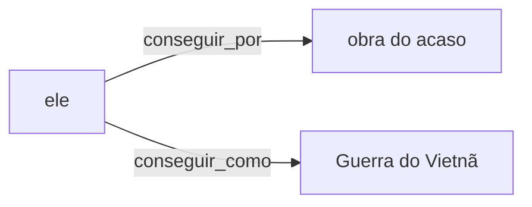
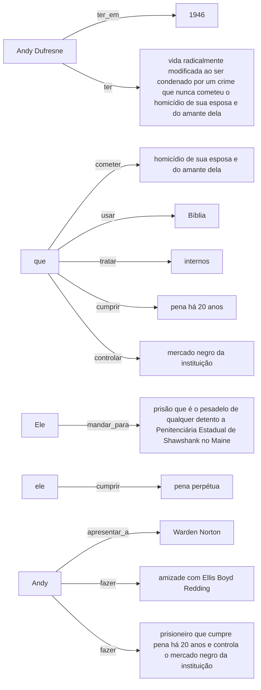
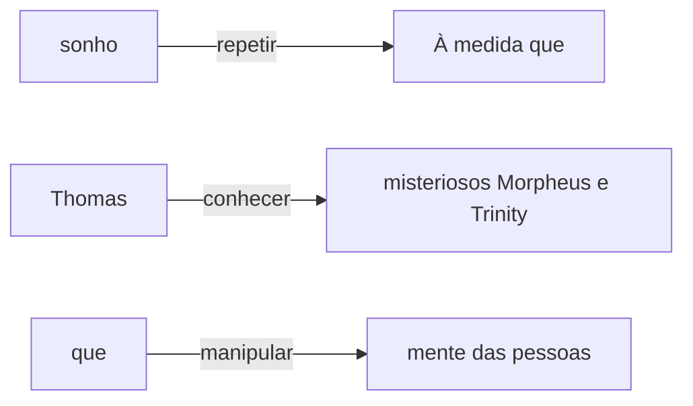
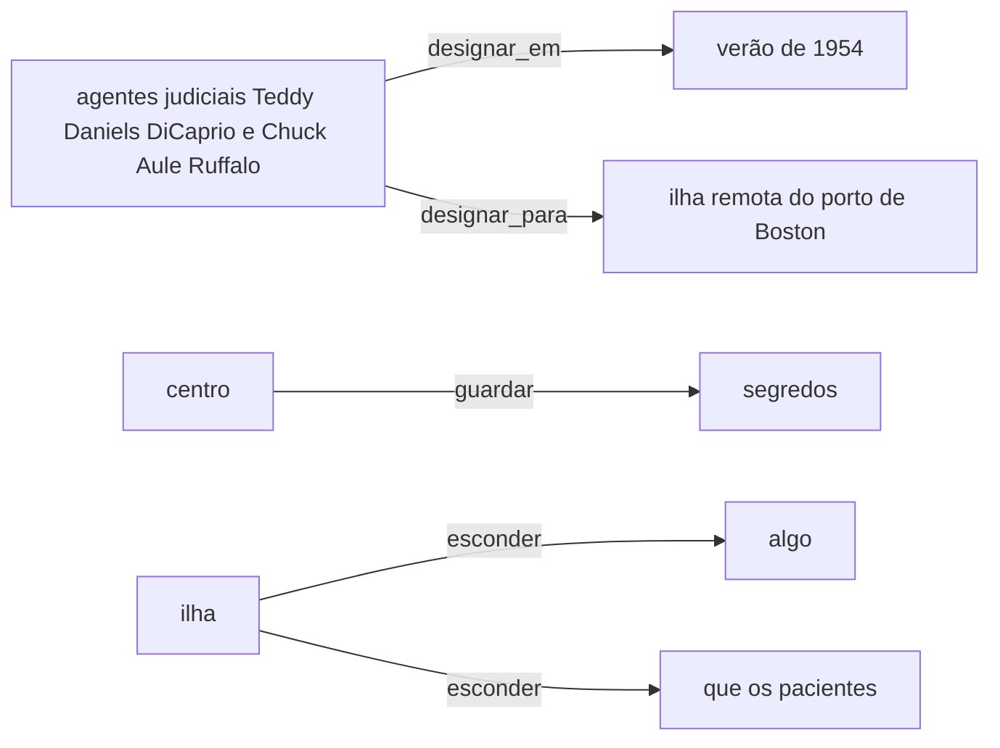

# Entidades nomeadas e relações nas sinopses

As 428 sinopses passam pelo spaCy `pt_core_news_sm`, o modelo do notebook da Aula 9: texto → dependências e NER → relações → normalização dos argumentos → grafo. O spaCy processou tudo em 3,3 s.

## Entidades

1671 menções reconhecidas. O modelo só conhece quatro categorias: PER (pessoa), LOC (lugar), ORG (organização) e MISC (outras).

| Categoria | Menções | Mais frequentes |
|---|---:|---|
| LOC | 491 | Terra (26), Nova York (15), Los Angeles (15), Estados Unidos (10), Paris (8), Woody (7), Londres (5), Europa (5) |
| MISC | 199 | Segunda Guerra Mundial (10), Alex (6), Blade (5), Nick (4), Harry (3), Guerra do Vietnã (2), T-800 (2), Matrix (2) |
| ORG | 102 | FBI (8), Marty (4), Força (4), Dra (2), Jaegers (2), Caso Watergate (1), Palhaços (1), McFly (1) |
| PER | 879 | Andy (8), Peter Parker (8), Ash (8), Shrek (7), David (7), Thor (7), Ripley (6), Fiona (6) |

## Conferência com os créditos do TMDB

Uma menção de pessoa creditada é uma sequência de palavras da sinopse que fazem parte do nome de um personagem ou ator do filme (os 15 primeiros do elenco). Foram 983 menções, em 325 sinopses.

| Medida | Valor |
|---|---:|
| Revocação de pessoas: menções creditadas marcadas como PER | 73,7% |
| Menções creditadas reconhecidas com qualquer categoria | 98,5% |
| Precisão estimada (piso): entidades PER com nome dos créditos | 81,6% de 879 |

Categoria dada às menções creditadas: LOC 145, MISC 68, ORG 31, PER 724, nao_reconhecida 15.

Pessoas creditadas que o NER não marcou como PER (exemplos):

- *Forrest Gump: O Contador de Histórias*: "Forrest Gump" → MISC
- *Beleza Americana*: "Ricky" → LOC
- *9 Canções*: "Lisa" → MISC
- *Brilho Eterno de uma Mente sem Lembranças*: "Clementine" → LOC
- *Gladiador*: "Maximus" → LOC
- *Gladiador*: "Maximus" → LOC
- *O Profissional*: "Mathilda" → LOC
- *O Profissional*: "Léon" → LOC
- *O Profissional*: "Tony" → MISC
- *O Profissional*: "Mathilda" → LOC

Entidades PER sem nenhum nome dos créditos (exemplos; parte são pessoas reais fora do elenco principal):

- *De Volta para o Futuro II*: "Doc"
- *De Volta para o Futuro II*: "Hill Valley"
- *O Fabuloso Destino de Amélie Poulain*: "Certo"
- *Coração Valente*: "Rei"
- *Encontro Marcado*: "Anjo da Morte"
- *De Olhos Bem Fechados*: "Bill"
- *O Diabo Veste Prada*: "Andrea"
- *Batman & Robin*: "Hera Venenosa"
- *À Espera de um Milagre*: "Penitenciária Cold Mountain"
- *Homem-Aranha 3*: "Homem-Aranha"

## Relações

Triplas sujeito — relação → objeto pelas regras de dependência do notebook: sujeito (`nsubj`, `nsubj:pass`) de um verbo com cada complemento (`obj`, `iobj`, `obl`); no `obl`, a preposição entra na relação (`trabalhar_em`). Os argumentos são a entidade que contém o núcleo ou o sintagma sem artigo e preposição iniciais.

| Medida | Valor |
|---|---:|
| Triplas | 1435 |
| Pelas regras do notebook (objeto direto e complemento com preposição) | 1347 (732 `svo`, 615 `obl`) |
| A mais pela regra de coordenação (verbo coordenado herda o sujeito) | 88 |
| Sentenças com ao menos uma tripla | 775 de 1220 (63,5%) |
| Triplas com entidades nos dois lados | 31 (2,2%) |
| Triplas cujo sujeito é só um pronome pessoal ou relativo ("Ela", "que") | 499 |

Relações mais frequentes: `ter` (45), `levar` (36), `encontrar` (28), `tornar` (21), `fazer` (17), `descobrir` (16), `conhecer` (15), `mudar` (14), `enfrentar` (14), `transformar` (12), `formar` (11), `entrar_em` (10), `passar` (10), `dar` (10), `precisar` (9).

## Exemplo: Forrest Gump: O Contador de Histórias

> Quarenta anos da história dos Estados Unidos, vistos pelos olhos de Forrest Gump, um rapaz com QI abaixo da média e com boas intenções. Por obra do acaso, ele consegue participar de momentos cruciais, como a Guerra do Vietnã e o Caso Watergate, mas continua pensando no seu amor de infância, Jenny Curran.

Entidades: Estados Unidos (LOC), Forrest Gump (MISC), Guerra do Vietnã (MISC), Caso Watergate (ORG), Jenny Curran (PER).

Dependências da primeira sentença (até 25 tokens; a tabela completa está em `examples.json`):

| Token | Lema | Classe | Dependência | Núcleo |
|---|---|---|---|---|
| Quarenta | quarenta | NUM | nummod | anos |
| anos | ano | NOUN | ROOT | anos |
| da | de o | ADP | case | história |
| história | história | NOUN | nmod | anos |
| dos | de o | ADP | case | Estados |
| Estados | Estados | PROPN | nmod | história |
| Unidos | Unidos | PROPN | flat:name | Estados |
| , | , | PUNCT | punct | vistos |
| vistos | visto | ADJ | appos | anos |
| pelos | por o | ADP | case | olhos |
| olhos | olho | NOUN | obl:agent | vistos |
| de | de | ADP | case | Forrest |
| Forrest | Forrest | PROPN | nmod | olhos |
| Gump | Gump | PROPN | flat:name | Forrest |
| , | , | PUNCT | punct | rapaz |
| um | um | DET | det | rapaz |
| rapaz | rapaz | NOUN | conj | anos |
| com | com | ADP | case | QI |
| QI | QI | PROPN | nmod | rapaz |
| abaixo | abaixo | ADV | advmod | rapaz |
| da | de o | ADP | case | média |
| média | média | NOUN | obl | abaixo |
| e | e | CCONJ | cc | intenções |
| com | com | ADP | case | intenções |
| boas | bom | ADJ | amod | intenções |

| Sentença | Sujeito | Relação | Objeto | Regra |
|---:|---|---|---|---|
| 2 | ele | `conseguir_por` | obra do acaso | obl |
| 2 | ele | `conseguir_como` | Guerra do Vietnã | obl |

## Exemplo: Um Sonho de Liberdade

> Em 1946, Andy Dufresne, um banqueiro jovem e bem sucedido, tem a sua vida radicalmente modificada ao ser condenado por um crime que nunca cometeu, o homicídio de sua esposa e do amante dela. Ele é mandado para uma prisão que é o pesadelo de qualquer detento, a Penitenciária Estadual de Shawshank, no Maine. Lá ele irá cumprir a pena perpétua. Andy logo será apresentado a Warden Norton, o corrupto e cruel agente penitenciário, que usa a Bíblia como arma de controle e ao Capitão Byron Hadley que trata os internos como animais. Andy faz amizade com Ellis Boyd Redding, um prisioneiro que cumpre pena há 20 anos e controla o mercado negro da instituição.

Entidades: Andy Dufresne (PER), Penitenciária Estadual de Shawshank (LOC), Maine (LOC), Warden Norton (PER), Bíblia (MISC), Capitão Byron Hadley (PER), Andy (PER), Ellis Boyd Redding (PER).

Dependências da primeira sentença (até 25 tokens; a tabela completa está em `examples.json`):

| Token | Lema | Classe | Dependência | Núcleo |
|---|---|---|---|---|
| Em | em | ADP | case | 1946 |
| 1946 | 1946 | NUM | obl | tem |
| , | , | PUNCT | punct | 1946 |
| Andy | Andy | PROPN | nsubj | tem |
| Dufresne | Dufresne | PROPN | flat:name | Andy |
| , | , | PUNCT | punct | banqueiro |
| um | um | DET | det | banqueiro |
| banqueiro | banqueiro | NOUN | appos | Andy |
| jovem | jovem | ADJ | amod | banqueiro |
| e | e | CCONJ | cc | sucedido |
| bem | bem | ADV | advmod | sucedido |
| sucedido | sucedido | ADJ | conj | jovem |
| , | , | PUNCT | punct | banqueiro |
| tem | ter | VERB | ROOT | tem |
| a | o | DET | det | vida |
| sua | seu | DET | det | vida |
| vida | vida | NOUN | obj | tem |
| radicalmente | radicalmente | ADJ | advmod | modificada |
| modificada | modificar | VERB | acl | vida |
| ao | a o | SCONJ | mark | condenado |
| ser | ser | AUX | aux:pass | condenado |
| condenado | condenar | VERB | acl | vida |
| por | por | ADP | case | crime |
| um | um | DET | det | crime |
| crime | crime | NOUN | obl:agent | condenado |

| Sentença | Sujeito | Relação | Objeto | Regra |
|---:|---|---|---|---|
| 1 | Andy Dufresne | `ter_em` | 1946 | obl |
| 1 | Andy Dufresne | `ter` | vida radicalmente modificada ao ser condenado por um crime que nunca cometeu o homicídio de sua esposa e do amante dela | svo |
| 1 | que | `cometer` | homicídio de sua esposa e do amante dela | svo |
| 2 | Ele | `mandar_para` | prisão que é o pesadelo de qualquer detento a Penitenciária Estadual de Shawshank no Maine | obl |
| 3 | ele | `cumprir` | pena perpétua | svo |
| 4 | Andy | `apresentar_a` | Warden Norton | obl |
| 4 | que | `usar` | Bíblia | svo |
| 4 | que | `tratar` | internos | svo |
| 5 | Andy | `fazer` | amizade com Ellis Boyd Redding | svo |
| 5 | Andy | `fazer` | prisioneiro que cumpre pena há 20 anos e controla o mercado negro da instituição | svo |
| 5 | que | `cumprir` | pena há 20 anos | svo |
| 5 | que | `controlar` | mercado negro da instituição | coordenacao |

## Exemplo: Matrix

> O jovem programador Thomas Anderson é atormentado por estranhos pesadelos em que está sempre conectado por cabos a um imenso sistema de computadores do futuro. À medida que o sonho se repete, ele começa a desconfiar da realidade. Thomas conhece os misteriosos Morpheus e Trinity e descobre que é vítima de um sistema inteligente e artificial chamado Matrix, que manipula a mente das pessoas e cria a ilusão de um mundo real enquanto usa os cérebros e corpos dos indivíduos para produzir energia.

Entidades: Thomas Anderson (PER), Thomas (PER), Morpheus (PER), Trinity (PER), Matrix (MISC).

Dependências da primeira sentença (até 25 tokens; a tabela completa está em `examples.json`):

| Token | Lema | Classe | Dependência | Núcleo |
|---|---|---|---|---|
| O | o | DET | det | programador |
| jovem | jovem | ADJ | amod | programador |
| programador | programador | NOUN | nsubj:pass | atormentado |
| Thomas | Thomas | PROPN | appos | programador |
| Anderson | Anderson | PROPN | flat:name | Thomas |
| é | ser | AUX | aux:pass | atormentado |
| atormentado | atormentar | VERB | ROOT | atormentado |
| por | por | ADP | case | pesadelos |
| estranhos | estranho | ADJ | amod | pesadelos |
| pesadelos | pesadelo | NOUN | obl:agent | atormentado |
| em | em | ADP | case | que |
| que | que | PRON | obl | conectado |
| está | estar | AUX | aux:pass | conectado |
| sempre | sempre | ADV | advmod | conectado |
| conectado | conectar | VERB | acl:relcl | pesadelos |
| por | por | ADP | case | cabos |
| cabos | cabo | NOUN | obl:agent | conectado |
| a | a | ADP | case | sistema |
| um | um | DET | det | sistema |
| imenso | imenso | ADJ | amod | sistema |
| sistema | sistema | NOUN | obl | conectado |
| de | de | ADP | case | computadores |
| computadores | computador | NOUN | nmod | sistema |
| do | de o | ADP | case | futuro |
| futuro | futuro | NOUN | nmod | computadores |

| Sentença | Sujeito | Relação | Objeto | Regra |
|---:|---|---|---|---|
| 2 | sonho | `repetir` | À medida que | obl |
| 3 | Thomas | `conhecer` | misteriosos Morpheus e Trinity | svo |
| 3 | que | `manipular` | mente das pessoas | svo |

## Exemplo: Ilha do Medo

> No verão de 1954, os agentes judiciais Teddy Daniels (DiCaprio) e Chuck Aule (Ruffalo) foram designados para uma ilha remota do porto de Boston para investigar o desaparecimento de uma perigosa assassina (Mortimer) que estava reclusa no hospital psiquiátrico Ashecliffe, um centro penitenciário para criminosos perturbados dirigido pelo sinistro médico John Cawley. (Kingsley). Logo eles descobrem que o centro guarda muitos segredos e que a ilha esconde algo mais perigoso que os pacientes.

Entidades: Teddy Daniels (PER), DiCaprio (PER), Chuck Aule (PER), Ruffalo (PER), Boston (LOC), Mortimer (PER), Ashecliffe (LOC), John Cawley (PER), Kingsley (PER).

Dependências da primeira sentença (até 25 tokens; a tabela completa está em `examples.json`):

| Token | Lema | Classe | Dependência | Núcleo |
|---|---|---|---|---|
| No | em o | ADP | case | verão |
| verão | verão | NOUN | obl | designados |
| de | de | ADP | case | 1954 |
| 1954 | 1954 | NUM | nmod | verão |
| , | , | PUNCT | punct | verão |
| os | o | DET | det | agentes |
| agentes | agente | NOUN | nsubj:pass | designados |
| judiciais | judicial | ADJ | amod | agentes |
| Teddy | Teddy | PROPN | appos | agentes |
| Daniels | Daniels | PROPN | flat:name | Teddy |
| ( | ( | PUNCT | punct | DiCaprio |
| DiCaprio | DiCaprio | PROPN | parataxis | Teddy |
| ) | ) | PUNCT | punct | DiCaprio |
| e | e | CCONJ | cc | Chuck |
| Chuck | Chuck | PROPN | conj | Teddy |
| Aule | Aule | PROPN | flat:name | Chuck |
| ( | ( | PUNCT | punct | Ruffalo |
| Ruffalo | Ruffalo | PROPN | parataxis | Chuck |
| ) | ) | PUNCT | punct | Ruffalo |
| foram | ser | AUX | aux:pass | designados |
| designados | designar | VERB | ROOT | designados |
| para | para | ADP | case | ilha |
| uma | um | DET | det | ilha |
| ilha | ilha | NOUN | obl | designados |
| remota | remoto | ADJ | amod | ilha |

| Sentença | Sujeito | Relação | Objeto | Regra |
|---:|---|---|---|---|
| 1 | agentes judiciais Teddy Daniels DiCaprio e Chuck Aule Ruffalo | `designar_em` | verão de 1954 | obl |
| 1 | agentes judiciais Teddy Daniels DiCaprio e Chuck Aule Ruffalo | `designar_para` | ilha remota do porto de Boston | obl |
| 3 | centro | `guardar` | segredos | svo |
| 3 | ilha | `esconder` | algo | svo |
| 3 | ilha | `esconder` | que os pacientes | svo |

## Conferência manual

`review_sample.json` traz 40 triplas sorteadas, com a sentença de origem e o campo `correta` vazio, para a equipe julgar como no notebook. Sem esse julgamento, este relatório não afirma a precisão das relações.

## Limitações (as da seção 8 do notebook, medidas nas sinopses)

- **Correferência:** 499 triplas têm um pronome ("Ela", "que") como sujeito, que não é ligado ao personagem.
- **Voz passiva com agente:** em "Thomas Anderson é atormentado por estranhos pesadelos", o agente é `obl:agent`, fora das regras do notebook, e não há tripla.
- **Taxonomia do modelo:** não há categorias para datas, valores ou obras; "Universidade de Paris" vira LOC, e títulos de filmes viram MISC ou PER.
- **Nomes estrangeiros e de personagens** são a maior parte das pessoas das sinopses; o modelo, treinado em notícias, erra mais com eles.
- **Papéis semânticos, negação e tempo** não são representados; a voz passiva não vira agente–ação–paciente.
- **Propagação de erros:** falhas do parser e do NER passam para as triplas; a tabela guarda a sentença de origem para conferência.
