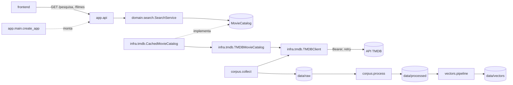

# Arquitetura do código

O backend (`backend/src/app`) reúne dois subsistemas independentes que compartilham utilitários:

- **Pipelines offline** (`corpus`, `vectors`): produzem as evidências avaliadas nas Etapas 1 e 2.
- **API de demonstração** (`api`, `domain`, `infra`): pesquisa auxiliar de filmes usada pela interface em `frontend/`.

As razões de cada escolha estão nas [ADRs](adr/README.md); a organização em camadas, na [ADR 0004](adr/0004-arquitetura-em-camadas.md).

## Pacotes

| Pacote | Responsabilidade | Depende de |
|---|---|---|
| `app.settings` | Configuração lida do ambiente e de `backend/.env` | pydantic-settings |
| `app.main` | Composição da API (`create_app`): cliente, catálogo com cache, serviço, limite de taxa, CORS | todos da API |
| `app.api` | Rotas, esquemas de resposta (contrato em português), dependências e limite de taxa | `domain`, `shared` |
| `app.domain.search` | Regras da pesquisa: normalização, léxico, negação, período, extrator e estratégias por modo | `shared`, portas próprias |
| `app.infra.tmdb` | Cliente HTTP, catálogo (Adapter) e cache com expiração (Decorator) | `domain.search.ports`, `settings` |
| `app.shared` | Artefatos determinísticos, manifesto, validação de configuração e regras de língua | biblioteca padrão |
| `app.corpus` | Etapa 1: coleta, transformações, estatísticas, relatório, contrato e verificação | `shared`; `infra.tmdb` só na coleta real |
| `app.vectors` | Etapa 2: representações, análises, relatório e verificação | `corpus.contracts`, `corpus.verification`, `corpus.transform`, `shared` |

O domínio não importa `infra` nem `api`; a infraestrutura implementa as portas do domínio; `main` liga as partes.

## Fluxo da pesquisa

1. `GET /pesquisa` valida `q` (1 a 200 caracteres), `pagina`, `ano` e `modo` e aplica o limite de requisições.
2. `SearchService` escolhe a estratégia do modo ([ADR 0006](adr/0006-prioridade-de-titulo-exato.md)):
   - `TitleSearch` busca por título;
   - `DiscoverySearch` extrai preferências com `FilterExtractor` ([ADR 0005](adr/0005-pesquisa-por-regras-lexicas.md)) e consulta a descoberta;
   - `AutomaticSearch` combina as duas.
3. O catálogo com cache reaproveita o mapa de gêneros e as buscas recentes por título ([ADR 0007](adr/0007-cliente-http-e-cache.md)).
4. `SearchResponse.from_result` traduz o resultado para o contrato JSON (`modo`, `resultados`, `interpretacao`).
5. Falhas do catálogo viram HTTP 502; filme inexistente vira 404.

## Fluxo dos pipelines

1. `python -m app.corpus collect` valida `config/coleta.json`, coleta recortes gênero × período e filmes semente e grava respostas, filmes deduplicados, participação nos recortes e manifesto.
2. `python -m app.corpus process` verifica a coleta, gera as seis representações, metadados, estatísticas, exemplos e o relatório (template em `corpus/templates/report.md`) e termina com `verify`.
3. `python -m app.vectors build` verifica a pasta processada e valida a configuração. Em seguida constrói as representações registradas em `METHODS`, executa `DEFAULT_ANALYSES`, serializa tudo em memória e só então cria a pasta ([ADR 0009](adr/0009-saidas-imutaveis-e-verificaveis.md)).

## Como estender

| Para | Faça |
|---|---|
| Novo modo de pesquisa | Crie uma classe com `search(request) -> SearchResult`, registre-a em `SearchService` e acrescente o valor em `SearchMode` |
| Nova fonte de filmes | Implemente `MovieCatalog` e `MovieDetailsProvider` em `app.infra` e injete-a em `create_app` |
| Novo gatilho de gênero ou marcador de negação | Edite `domain/search/lexicon.py` ou `shared/language.py` e atualize a ADR 0005 ou 0003 |
| Nova representação vetorial | Implemente `Representation` e um método com `build`, e registre-o em `vectors/methods.py` |
| Nova análise vetorial | Subclasse de `Analysis` com `run` e `report_section`, acrescentada a `DEFAULT_ANALYSES` |

## Testes

| Arquivo | Cobertura |
|---|---|
| `test_corpus.py` | Transformações, coleta simulada, validação da configuração, integridade, determinismo |
| `test_vectors.py` | Representações (com modelos falsos), análises, relatório, segurança da configuração, verificação |
| `test_search_extractor.py` | Gatilhos, negação, qualidade, períodos e acurácia por campo |
| `test_search_service.py` | Estratégias de pesquisa e número de chamadas ao catálogo |
| `test_tmdb.py` | Cliente (erros, sessões por thread, retry, token fora da URL), catálogo e cache |
| `test_api.py` | Contrato das rotas, validação, 404/502, CORS e limite 429 |

`tests/fakes.py` contém o catálogo falso compartilhado. Nenhum teste acessa a rede.
