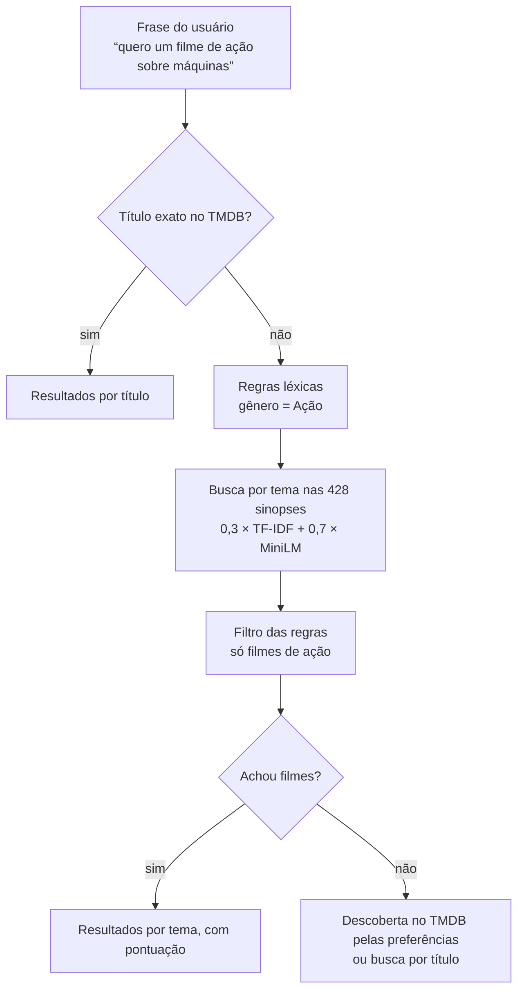

# Busca do site

Como o site encontra filmes a partir do que o usuário digita, quais algoritmos do projeto participam e por que foram escolhidos. A decisão formal, com as alternativas descartadas, está no [ADR 0018](adr/0018-busca-hibrida-tfidf-e-sentenca.md).

## Visão geral

A busca junta duas técnicas que se completam:

- **Regras léxicas**, que já existiam: reconhecem na frase o que é **estrutura**, como gênero ("ação", "sem comédia"), período ("dos anos 80", "depois de 2015") e qualidade ("bem avaliado").
- **Busca por tema**, a parte nova: ordena os filmes pela **proximidade entre a frase e a sinopse**, combinando dois algoritmos do projeto:

  **pontuação = 0,3 × TF-IDF sem stopwords + 0,7 × embedding de sentença (MiniLM)**

As regras filtram, e a busca por tema ordena.



## Os modos de busca

| Modo no site | Parâmetro | O que faz |
|---|---|---|
| Automático | `modo=auto` | Segue esta ordem: 1. título exato; 2. tema nas sinopses, quando acha filmes; 3. descoberta pelas preferências; 4. título |
| Título | `modo=titulo` | Busca o título no TMDB |
| Preferências | `modo=descoberta` | Regras → descoberta do TMDB, ordenada por popularidade |
| **Tema (sinopses)** | `modo=sinopse` | Regras filtram e a combinação TF-IDF + MiniLM ordena os filmes da amostra |

O modo automático tenta o título exato primeiro para que "Matrix" traga o filme Matrix, e não filmes *parecidos* com Matrix.

## Os dois algoritmos da combinação

As duas representações já existiam no projeto desde a Etapa 2. A busca só as reaproveita.

### TF-IDF sem stopwords (`tfidf_sem_stopwords`)

- **O que é:** cada sinopse vira um vetor com uma posição por palavra do vocabulário. O peso é a frequência da palavra na sinopse (TF) multiplicada pela raridade dela no corpus (IDF). A preparação vem da Etapa 1: minúsculas, sem pontuação e sem stopwords, preservando acentos e negações.
- **No que é bom:** palavras-chave fortes e nomes próprios. Se a frase diz "zumbis", ele acha as sinopses que dizem "zumbis".
- **Onde falha:** só casa palavras idênticas. "Máquinas" não encontra "robôs", e "simulação" não encontra Matrix, cuja sinopse fala em "ilusão de um mundo real".

### Embedding de sentença (`sentenca_minilm`)

- **O que é:** o modelo `paraphrase-multilingual-MiniLM-L12-v2`, um transformer da família do BERT, compactado e **treinado para aproximar frases de mesmo sentido**. Cada sinopse inteira vira um vetor de 384 números.
- **No que é bom:** entende o tema sem palavras em comum. Em "inteligência artificial que se volta contra a humanidade", os 5 primeiros são todos relevantes: Eu, Robô; O Exterminador do Futuro; Blade Runner; Alice: Subservience; e Vingadores: Era de Ultron.
- **Onde falha:** às vezes perde para a palavra exata. Em "zumbis", achou menos filmes de zumbi que o TF-IDF.

Ele não é o BERTimbau (`bert_base_pt`) do projeto. O BERTimbau foi treinado só para adivinhar palavras escondidas e dá similaridade alta para quase qualquer par de frases, por isso não serve para comparar uma consulta com sinopses.

### Por que somar os dois

Cada um erra onde o outro acerta. Precisão média (AP) em algumas das consultas anotadas:

| Consulta | TF-IDF | MiniLM | Combinação |
|---|---:|---:|---:|
| inteligência artificial que se volta contra a humanidade | 0,38 | **0,86** | 0,84 |
| astronautas perdidos no espaço lutando para sobreviver | 0,43 | **0,90** | 0,92 |
| família aterrorizada por espíritos em uma casa assombrada | **0,63** | 0,37 | 0,66 |
| sobreviventes em um mundo tomado por zumbis | **0,62** | 0,34 | 0,44 |
| vampiros | 0,22 | 0,56 | **0,64** |

Somados, os dois ficam melhores que qualquer um sozinho na média das 20 consultas. A combinação melhora 13 delas e piora 4 em relação ao MiniLM sozinho.

## Como a pontuação é calculada

Os dois algoritmos dão notas em escalas diferentes. O cosseno do TF-IDF costuma ficar entre 0 e 0,3; o do MiniLM, entre 0,2 e 0,6. Somar direto daria peso demais ao MiniLM. Por isso, em cada consulta, **a nota de cada algoritmo é dividida pela maior nota que ele deu naquela consulta**, e o melhor filme de cada um vale 1. Só depois entram os pesos.

Exemplo real, "quero um filme de ação sobre máquinas". O maior cosseno do TF-IDF foi 0,218 (O Dublê) e o do MiniLM, 0,528 (O Exterminador do Futuro). Entre os filmes de ação:

| Filme | Cosseno TF-IDF | Cosseno MiniLM | Pontuação final |
|---|---:|---:|---:|
| O Exterminador do Futuro | 0,191 | 0,528 | 0,3 × 0,191/0,218 + 0,7 × 0,528/0,528 = **0,962** |
| Gigantes de Aço | 0,112 | 0,385 | **0,664** |
| Eu, Robô | 0 | 0,500 | **0,663** |
| O Dublê | 0,218 | 0,242 | **0,621** |
| Operação Big Hero | 0 | 0,412 | **0,546** |

"Eu, Robô" não tem nenhuma das palavras da frase, e o TF-IDF deu zero. Mesmo assim, o filme ficou em 3º porque o MiniLM entendeu que robôs são máquinas. "O Dublê" tem a palavra "filme" na sinopse, o que o TF-IDF premia, mas o MiniLM o deixou atrás.

## Como a combinação foi escolhida

1. **Consultas de teste:** o projeto tinha só 2 consultas anotadas, ambas sobre Matrix. A equipe escreveu 20 ([config/consultas.json](../config/consultas.json)), como um usuário digitaria, e marcou os filmes relevantes de cada uma **lendo as 428 sinopses antes de rodar qualquer algoritmo**, para não favorecer nenhum deles.
2. **Métricas:**
   - **MAP** (precisão média): quão acima estão todos os relevantes;
   - **MRR**: posição do primeiro relevante;
   - **acerto @5**: se há algum relevante entre os 5 primeiros;
   - **precisão @5**: quantos dos 5 primeiros são relevantes.
3. **Cada algoritmo sozinho:**

   | Algoritmo | MAP | MRR | Acerto @5 |
   |---|---:|---:|---:|
   | Embedding de sentença (MiniLM) | **0,560** | 0,879 | **100%** |
   | TF-IDF sem pontuação | 0,460 | 0,844 | 95% |
   | TF-IDF sem stopwords | 0,446 | **0,880** | 95% |
   | BoW sem stopwords | 0,375 | 0,765 | 90% |
   | word2vec skip-gram | 0,356 | 0,592 | 80% |
   | word2vec CBOW | 0,333 | 0,557 | 75% |
   | BERTimbau | 0,295 | 0,489 | 75% |
   | BoW sem pontuação | 0,188 | 0,357 | 45% |

4. **Combinações:** foram testadas todas as combinações de 2 a 4 algoritmos, somando as notas com pesos ou juntando as posições (RRF).

   | Combinação | MAP | MRR | Acerto @5 |
   |---|---:|---:|---:|
   | **0,3 × TF-IDF sem stopwords + 0,7 × MiniLM** (escolhida) | **0,613** | 0,912 | 100% |
   | 0,2 × TF-IDF + 0,3 × skip-gram + 0,5 × MiniLM | 0,617 | 0,950 | 100% |
   | TF-IDF + MiniLM por posição (RRF) | 0,573 | 0,899 | 95% |
   | MiniLM sozinho | 0,560 | 0,879 | 100% |

5. **Por que essa e não a de MAP maior:**
   - Com 20 consultas, diferenças abaixo de 0,01 são ruído.
   - Qualquer peso do TF-IDF entre 0,2 e 0,4 dá MAP de 0,60 a 0,62, e 0,3 fica no meio dessa faixa.
   - Acrescentar o skip-gram quase não muda o resultado e exigiria mais um modelo de cerca de 1,1 GB no servidor.
6. **Conferência contra sorte:** foram 500 sorteios, cada um escolhendo o peso com metade das consultas e medindo na outra metade. A combinação ganhou do MiniLM sozinho em 95% deles.

**Por que os outros algoritmos ficaram de fora:**
- O BoW é uma versão pior do TF-IDF, que é o próprio BoW com pesos.
- O word2vec tira a média das palavras e perde o sentido da frase.
- O BERTimbau não foi treinado para comparar frases.

## Onde está no código

| Parte | Arquivo |
|---|---|
| Pesos da combinação | [config/busca.json](../config/busca.json) |
| Combinação e avaliação | [backend/src/app/vectors/hybrid.py](../backend/src/app/vectors/hybrid.py) |
| Índice carregado pela API (sinopses, pôster, nota) | [backend/src/app/infra/synopsis/index.py](../backend/src/app/infra/synopsis/index.py) |
| Modo `sinopse` e ordem do modo automático | [backend/src/app/domain/search/service.py](../backend/src/app/domain/search/service.py) (`SynopsisSearch`, `AutomaticSearch`) |
| Filtros das regras aplicados aos filmes | [backend/src/app/domain/search/extractor.py](../backend/src/app/domain/search/extractor.py) (`ExtractedFilters.accepts`) |
| Opção no site | [frontend/index.html](../frontend/index.html) |

A API carrega o índice uma vez, ao iniciar, e leva alguns segundos. Os vetores das sinopses são calculados nessa hora; a cada busca, só a frase do usuário passa pelos modelos. Sem o extra `semantico`, a API sobe mesmo assim, e o modo `sinopse` responde "Busca por sinopse indisponível".

## Como reproduzir

Em `backend`:

```bash
uv sync --frozen --extra semantico
# comparar cada algoritmo com a combinação nas 20 consultas
uv run --frozen --extra semantico python -m app.vectors hybrid --input ../data/processed/tmdb_2026-09-12 --config ../config/vetorizacao_semantica.json --search ../config/busca.json --queries ../config/consultas.json
# buscar uma frase qualquer
uv run --frozen --extra semantico python -m app.vectors hybrid --input ../data/processed/tmdb_2026-09-12 --config ../config/vetorizacao_semantica.json --search ../config/busca.json --text "filme sobre viagem no tempo"
```

Para testar outra combinação, basta mudar os nomes e os pesos em `config/busca.json` e rodar o primeiro comando de novo.

## Limitações

- **Só encontra o que está na base.** A busca por tema procura entre os **428 filmes da amostra**, coletados em 4 gêneros. Em "filme de cobra", só as duas *Anaconda* e *Zootopia 2* falam de cobras ou répteis; os outros resultados são apenas os menos distantes. Filmes fora da amostra continuam acessíveis pelo título e pela descoberta do TMDB.
- **Não há nota mínima.** A busca mostra todo filme com alguma semelhança, então sempre completa a página, mesmo quando poucos resultados são relevantes.
- **Palavras de pedido pesam.** "Quero" e "filme" entram no TF-IDF e favorecem sinopses que as contêm. Com o filtro de gênero o efeito é pequeno; sem filtro, pode trazer filmes fora do tema, como Holocausto Canibal em "filme sobre simulação da realidade".
- **Tom e gênero são difíceis para o ranking.** Em "comédia romântica leve", todos os algoritmos erraram (MAP de 0,12). Nesses casos, os filtros das regras ajudam mais.
- **A avaliação é da equipe.** As 20 consultas foram escritas e julgadas pela equipe. Servem para comparar os algoritmos, mas não substituem um teste com usuários.

## Próximos passos possíveis

| Melhoria | Resolve |
|---|---|
| Remover palavras de pedido ("quero", "filme de", "me indica") antes de ordenar | Resultados fora do tema puxados por "filme" |
| Nota mínima, calibrada nas consultas anotadas, e aviso de "nenhum filme encontrado" | Página completada com filmes irrelevantes |
| Base maior para o site, com milhares de filmes de todos os gêneros e separada da amostra entregue | "Filme de cobra" e outros temas ausentes da amostra |
| Reordenar com o MiniLM candidatos buscados no TMDB ao vivo | Busca por tema em todo o catálogo do TMDB |
