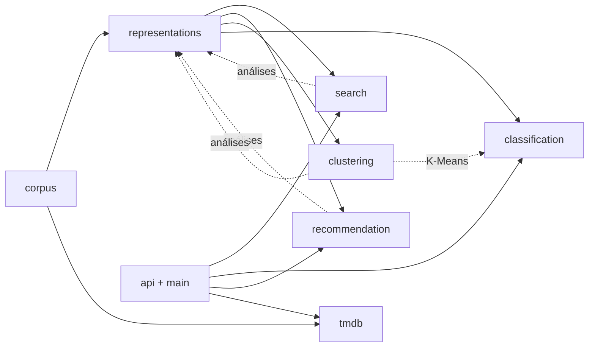

# Arquitetura do código

O backend (`backend/src/app`) é organizado **por tarefa da disciplina**: cada pasta reúne o código de uma etapa ou tarefa, do algoritmo à avaliação ([ADR 0022](../adr/0022-organizacao-por-tarefa.md)). A API do site e os utilitários compartilhados ficam em pastas próprias. As razões de cada escolha estão nas [ADRs](../adr/README.md).

## Pastas

| Pasta | Tarefa | Conteúdo principal |
|---|---|---|
| `corpus/` | 1. Coleta e preparação | Coleta no TMDB, seis preparações do texto, estatísticas, relatório e verificação |
| `representations/` | 2. Representações | As oito representações (`space.py`, `embeddings.py`, `methods.py`), o pipeline que as constrói e roda as análises (`pipeline.py`), sondas da Aula 7 e relatório |
| `search/` | 3. Busca | Regras léxicas (`rules/`), busca por cosseno (`retrieval.py`), combinação TF-IDF + embedding de sentença (`hybrid.py`), avaliação com consultas anotadas (`evaluation.py`), serviço do site (`service.py`) e índice de sinopses (`synopsis_index.py`) |
| `recommendation/` | 4. Recomendação | Filme → filmes e perfil → filmes, com avaliação por gênero compartilhado (`analysis.py`), e os filmes parecidos do site (`similar.py`) |
| `clustering/` | 5. Agrupamento e visualização | K-Means e projeção 2D (`kmeans.py`), avaliação (`analysis.py`) e gráficos SVG (`svg.py`) |
| `classification/` | 6. Classificação | Regressão logística com validação cruzada (`pipeline.py`, `evaluation.py`), classificadores alternativos, classificador da tela (`live.py`) e o Jev (`jev/`) |
| `api/` | Site | Rotas `/pesquisa`, `/filmes`, `/filmes/{id}/parecidos`, `/classificacao` e `/saude`, esquemas de resposta e limite de requisições |
| `tmdb/` | Fonte de dados | Cliente HTTP do TMDB, catálogo e cache, usados pela coleta e pela API |
| `shared/` | — | Artefatos determinísticos, manifesto, validação de configuração e regras de língua |
| `main.py`, `settings.py` | Site | Montagem da API (`create_app`) e configuração lida do ambiente e de `backend/.env` |

Busca, recomendação e agrupamento rodam dentro do pipeline das representações: cada um é uma classe do padrão `Analysis`, e `representations/pipeline.py` as reúne em `DEFAULT_ANALYSES`. A classificação tem pipeline próprio, porque tem avaliação (validação cruzada) e saídas próprias.

## Dependências entre as pastas

As setas pontilhadas de volta para `representations` indicam que o pipeline importa as análises das tarefas para montar o relatório. As tarefas dependem só da classe base `Analysis` e dos tipos das representações, então não há importação circular.

## Dados e configurações

Cada etapa lê e grava pastas próprias. Toda saída tem `manifest.json` com o SHA-256 de cada arquivo e um comando `verify` ([ADR 0009](../adr/0009-saidas-imutaveis-e-verificaveis.md)).

| Etapa | Configuração | Comando | Saída |
|---|---|---|---|
| Coleta | `config/coleta/coleta.json` | `python -m app.corpus collect` | `data/coleta/` |
| Preparação | `config/coleta/stopwords_pt.txt` | `python -m app.corpus process` | `data/preparacao/` |
| Representações, busca, recomendação, agrupamento | `config/representacoes/`, `config/busca/consultas.json` | `python -m app.representations build` | `data/representacoes/` |
| Busca combinada | `config/busca/busca.json` | `python -m app.search hybrid` | saída no terminal |
| Classificação treinada | `config/classificacao/classificacao*.json` | `python -m app.classification build` | `data/classificacao/` |
| Jev | `config/classificacao/jev.json` | `python -m app.classification.jev run` | `data/jev/` |
| Análise de sentimentos | `config/sentimento/coleta_criticas.json`, `config/sentimento/sentimento.json` | `python -m app.sentiment collect`, `process`, `build` e `verify` | `data/coleta/criticas_2026-10-10/`, `data/preparacao/criticas_2026-10-10/` (fora do Git), `data/sentimento/` |
| Entidades e relações | `config/entidades/entidades.json` | `python -m app.entities credits`, `build` e `verify` | `data/coleta/creditos_2026-10-10/`, `data/entidades/` |
| Catálogo do site (busca e recomendação na API) | `config/coleta/coleta_site.json`, `config/representacoes/vetorizacao_site.json` | `corpus collect`, `corpus process` e `representations build` | `data/*/site_2026-10-05/` (fora do Git) |

Os rótulos de gênero são os mesmos em todas as etapas: `Document.genres` é o conjunto de `genre_ids` do TMDB restrito aos quatro gêneros da coleta.

## Fluxo de uma pesquisa no site

1. `GET /pesquisa` valida `q`, `pagina`, `ano` e `modo` e aplica o limite de requisições.
2. `search/service.py` escolhe a estratégia do modo:
   - **título:** busca o título no TMDB;
   - **preferências:** as regras extraem gênero, período e nota, e o TMDB faz a descoberta;
   - **tema:** os filmes da amostra são ordenados por 0,3 × TF-IDF + 0,7 × embedding de sentença e filtrados pelas regras ([ADR 0020](../adr/0020-busca-hibrida-tfidf-e-sentenca.md));
   - **automático:** título exato, depois tema, depois preferências, depois título ([ADR 0006](../adr/0006-prioridade-de-titulo-exato.md)).
3. A resposta é traduzida para o contrato JSON em português (`modo`, `resultados`, `interpretacao`). Falhas do TMDB viram 502, e filme inexistente vira 404.

`GET /filmes/{id}/parecidos` devolve os filmes de maior cosseno com o filme, na mesma representação ([ADR 0023](../adr/0023-recomendacao-no-site.md)). `GET /classificacao` passa o texto ao classificador da tela, treinado na inicialização com a representação que a busca por tema já carrega ([ADR 0021](../adr/0021-classificacao-na-tela.md)).

## Portas e adaptadores

Mesmo organizado por tarefa, o código mantém as dependências externas atrás de interfaces ([ADR 0004](../adr/0004-arquitetura-em-camadas.md)):

| Porta | Onde | Implementação real | Nos testes |
|---|---|---|---|
| `MovieCatalog`, `MovieDetailsProvider` | `search/ports.py` | `tmdb/catalog.py` com cache | `FakeCatalog` |
| `SynopsisIndex` | `search/ports.py` | `search/synopsis_index.py` | `FakeSynopsisIndex` |
| `GenreClassifier` | `classification/ports.py` | `classification/live.py` | `FakeGenreClassifier` |
| `SimilarMoviesProvider` | `recommendation/ports.py` | `recommendation/similar.py` | `FakeRecommender` |
| `DecisionClient` | `classification/jev/ports.py` | `classification/jev/typesafe_client.py` | Jev falso em `test_jev.py` |

## Como estender

| Para | Faça |
|---|---|
| Nova representação | Implemente `Representation` e um método com `build` e registre-o em `representations/methods.py` |
| Nova análise sobre as representações | Subclasse de `Analysis` com `run` e `report_section` no pacote da tarefa, acrescentada a `DEFAULT_ANALYSES` em `representations/pipeline.py` |
| Outra combinação na busca por tema | Edite `config/busca/busca.json` e compare com `python -m app.search hybrid --queries ../config/busca/consultas.json` |
| Novo modo de pesquisa | Crie uma estratégia com `search(request)` em `search/service.py` e acrescente o valor em `SearchMode` |
| Novo gatilho de gênero ou negação | Edite `search/rules/lexicon.py` ou `shared/language.py` |
| Novo classificador de comparação | Registre um `Alternative` em `classification/alternatives.py` e inclua o nome na configuração |
| Nova pergunta ao Jev | Edite `config/classificacao/jev.json`; outra redação exige novas chamadas |

## Testes

| Arquivo | Cobertura |
|---|---|
| `test_corpus.py` | Transformações, coleta simulada, validação da configuração, integridade e determinismo |
| `test_representations.py` | Representações (com modelos falsos), rótulos, busca, recomendação, agrupamento e gráficos, sondas, relatório, segurança da configuração, verificação, busca combinada e índice de sinopses |
| `test_search_extractor.py` | Regras: gatilhos, negação, qualidade e períodos |
| `test_search_service.py` | Estratégias de pesquisa e busca por tema com índice falso |
| `test_classification.py` | Tarefas, validação cruzada, decisão multirrótulo, K-Means × classificador, alternativos, reaproveitamento dos vetores e classificador da tela |
| `test_jev.py` | Amostra, perguntas, validação das respostas, falhas, reaproveitamento, métricas e adaptador do SDK (com um Jev falso) |
| `test_tmdb.py` | Cliente, catálogo e cache do TMDB |
| `test_api.py` | Contrato das rotas, validação, erros, CORS e limite de requisições |

`tests/fakes.py` contém os dublês compartilhados. Nenhum teste acessa a rede.
